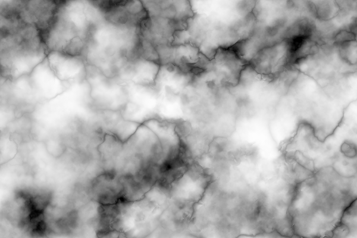

# Clover Noise
Clover Noise is a new noise algorithm created by ValgoBoi. It produces much more natural looking results, compared to its counterparts Perlin and Simplex noise. The algorithm has been optimized to be as fast as possible, for the best development experience possible.

# Images

Basic 2D Clover Noise.

Fractal 2D Clover Noise. This is created by compositing multiple layers of basic Clover Noise, with different scales and opacities.

A sort of "Icy" noise, created by layering layers of fractal Clover Noise, with some distortions in the input position.

A noise created to look like Marble. It uses similar techniques to Frost Noise, and a "difference" operation is used to create the lines on the marble.

This is just scratching the surface of what's possible with Clover Noise. If you'd like to see more textures and effects you can do with Clover Noise, check out [all the variations of Clover Noise](./variations/README.md)

# Implementations
Currently, Clover Noise has implementations in the following languages:
- [GLSL](./src/glsl)
- [Java](./src/java)

These implementations are free to use, as they are licensed under the MIT License. Credit is not required, but it is still greatly appreciated!