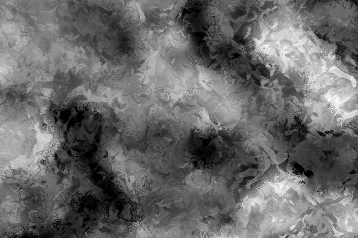
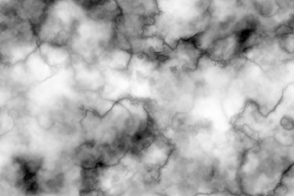

# Variations

There are many variations of Clover Noise that simulate different textures. These variations can be found here, with pseudo-code of their implementations.

## Frost Noise

Frost Noise is an icy-looking noise created with Clover Noise. It is created using Curl Clover Noise, and layering a few different layers of noise, some with offsets.

## Marble Noise

Marble Noise emulates the texture of Marble, a type of stone. It is created by taking the difference of two noise values, and darkening the areas where the two values are close together.

